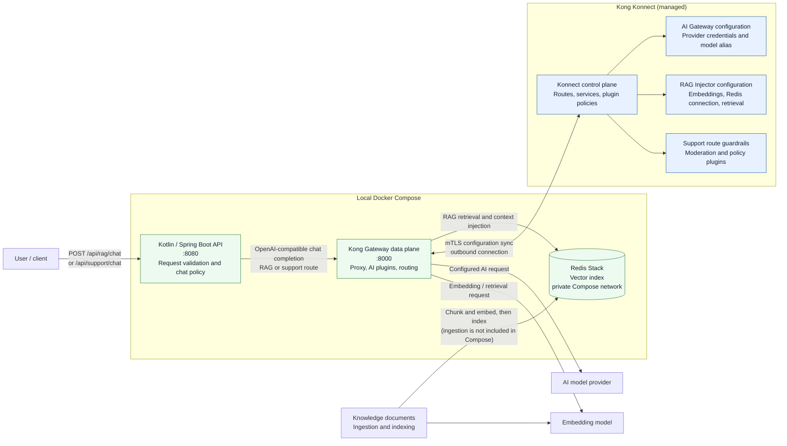

# Kotlin chatbot with Kong AI Gateway

This Spring Boot API exposes two chatbot flows and delegates all model calls to Kong AI Gateway. It contains no provider credentials and does not call a model provider directly.

```text
Client -> Kotlin/Spring API -> Kong AI Gateway -> AI provider
                                |-> RAG retrieval and vector store (RAG route)
                                |-> AI guardrails and policy plugins (support route)
```

## Chat flows

| Endpoint | Kong route | Purpose |
|---|---|---|
| `POST /api/rag/chat` | `/rag/v1/chat/completions` | Production-style RAG answers grounded in retrieved knowledge |
| `POST /api/support/chat` | `/support/v1/chat/completions` | Customer support with a conservative support policy |
| `POST /api/chat` | Same as the RAG route | Compatibility alias |

Request: `{"message":"How do I verify a production deployment?"}`. Response: `{"response":"..."}`.

The application validates that messages are non-empty and no longer than 8,000 characters. RAG and support system instructions are supplied separately. These instructions are defense in depth, not a security boundary: configure and enforce retrieval, moderation/guardrails, authentication, authorization, and rate limits in Kong. Attach a RAG injector and its vector-store configuration to each route that needs knowledge grounding, and apply the appropriate AI guardrail/policy plugins to the support route. Ensure both Kong routes accept OpenAI-compatible chat-completion requests and use the model alias configured below.

## Run locally with Docker Compose and Konnect

The Compose stack runs the Spring API, a Kong Gateway **data plane** connected to Kong Konnect, and a Redis Stack vector database for local RAG. Konnect's control plane and model provider remain managed/external services; Compose does not create those. The AI Gateway/RAG plugin availability depends on your Kong license and Konnect plan.

1. Create a Konnect control plane and register a self-managed data plane node in Runtime Manager. Download that node's cluster certificate and key, and copy them to `secrets/konnect-cluster.crt` and `secrets/konnect-cluster.key`. Keep those files private; `secrets/` and `.env` are git-ignored.
2. Copy `.env.example` to `.env`. Replace the cluster and telemetry endpoint/hostname examples with the values shown for your data plane in Konnect. Set `REDIS_PASSWORD` to a strong local password. Use a Kong Gateway image version compatible with the Konnect control plane.
3. In Konnect, configure the RAG and support services/routes with the paths in `.env`. Configure model credentials and provider routing in Konnect, not in this application. For RAG, configure the AI RAG Injector (and its required AI Proxy/embedding settings) to use Redis at `vector-db:6379`, with the `REDIS_PASSWORD` from `.env`; ensure its vector index has been populated with your knowledge documents. Configure the supported guardrail/policy plugins on the support route. The Konnect-managed configuration is delivered to the local data plane.
4. Create a sample local environment file, edit it with your Konnect and Redis values, then build/start the containers:

```bash
make setup-example-env
# Edit .env and replace the example Konnect endpoints and Redis password.
make up
```

The API is available at `http://localhost:8080`; Kong's local proxy is at `http://localhost:8000`. The vector database is only exposed on the private Compose network. Stop the stack with `Ctrl+C`, or run `docker compose down`; a named volume preserves the vector index. Use `docker compose down -v` only when you intend to delete that data.

Use `docker compose logs -f kong` or `make logs` to check data-plane connectivity. A successful container start alone does not mean the data plane has connected to Konnect or received route configuration. `make help` lists the available targets. `make setup-example-env` (also available as `make env`) creates `.env` from `.env.example` without overwriting an existing `.env`. Useful commands include `make test`, `make package`, `make build`, `make ps`, `make config`, and `make down`. `make down` preserves the vector database volume; `docker compose down -v` deletes it.

For a host-run Spring app instead, configure `KONG_URL=http://localhost:8000` in the environment and start the API with `mvn spring-boot:run`.

Example:

```bash
curl -X POST http://localhost:8080/api/rag/chat \
  -H 'Content-Type: application/json' \
  -d '{"message":"How do we verify a production deployment?"}'

curl -X POST http://localhost:8080/api/support/chat \
  -H 'Content-Type: application/json' \
  -d '{"message":"How can I update my account email?"}'
```

`KONG_URL` is the gateway base URL. `KONG_RAG_ROUTE` and `KONG_SUPPORT_ROUTE` select the two Kong paths; `KONG_MODEL` is the model alias recognized by Kong. Connect and read timeouts are configurable with `KONG_CONNECT_TIMEOUT` and `KONG_READ_TIMEOUT`. A gateway failure is returned as HTTP 502.

## Production deployment notes

This repository provides the chatbot API and gateway integration, not a complete deployment platform. Before exposing it to customers, add the application's identity/session authorization, tenant-scoped retrieval and data access, conversation persistence/retention policy, audit/trace correlation, monitoring, and deployment-specific secret/config management. Kong should enforce provider routing and credentials, RAG retrieval, guardrails, quotas/rate limits, and AI traffic observability.

## Tests

```bash
mvn test
```

## Complete architecture


